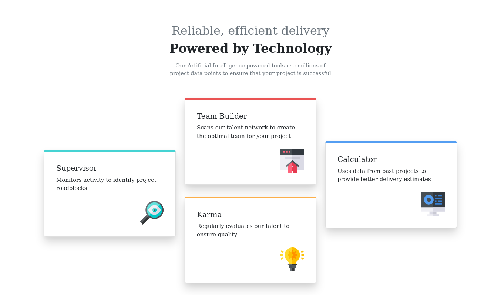

# Frontend Mentor - Four card feature section solution

This is a solution to the [Four card feature section challenge on Frontend Mentor](https://www.frontendmentor.io/challenges/four-card-feature-section-weK1eFYK). Frontend Mentor challenges help you improve your coding skills by building realistic projects.

## Table of contents

- [Overview](#overview)
  - [The challenge](#the-challenge)
  - [Screenshot](#screenshot)
  - [Links](#links)
- [My process](#my-process)
  - [Built with](#built-with)
- [Author](#author)

## Overview

### The challenge

Users should be able to:

- View the optimal layout for the site depending on their device's screen size

### Screenshot

### Links
- Solution URL: [solution URL here](https://github.com/CleanCoderK/Four_card_feature_section)
- Live Site URL: [live site URL here](https://cleancoderk.github.io/Four_card_feature_section/)

## My process

### Built with

- Semantic HTML5 markup
- CSS Grid
- Mobile-first workflow
- [bootstrap.css](https://getbootstrap.com/) - Bootstrap framework

## Author
- Frontend Mentor - [@CleanCoderK](https://www.frontendmentor.io/profile/green-cyber)
